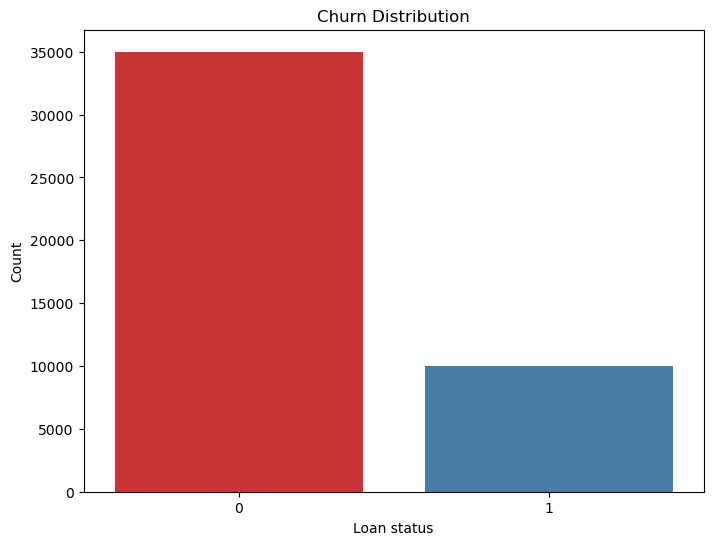
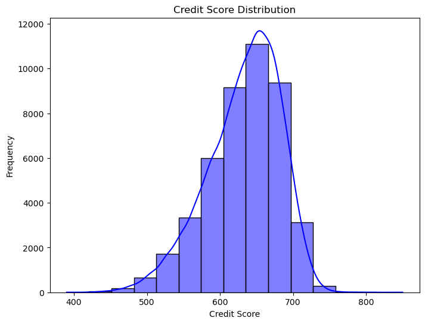
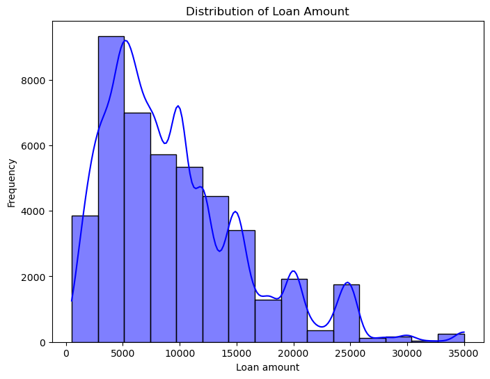
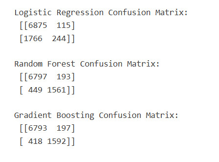

# 💳 Credit Risk Analysis & Loan Default Prediction

## 🎯 Problem Statement
Financial institutions face risks when approving loans.  
This project predicts whether a customer will default on a loan using historical data and machine learning techniques to support better decision-making.

---

## 📊 Exploratory Data Analysis

### 📌 Loan Status Distribution


### 📌 Credit Score vs Loan Status


### 📌 Loan Amount Distribution


---

## 🤖 Models Used

- Logistic Regression  
- Decision Tree  
- Random Forest  

---

## 🏆 Best Performing Model

👉 **[REPLACE THIS AFTER CHECKING NOTEBOOK]**

Example (write like this after checking results):

**Random Forest performed the best**, achieving higher accuracy and better classification of defaulters compared to Logistic Regression and Decision Tree.

---

## 📊 Model Performance

### 📌 Confusion Matrix


- Evaluates prediction performance  
- Helps identify correct vs incorrect classifications  

---

## 🛠️ Tools & Technologies
- Python (Pandas, NumPy)  
- Matplotlib, Seaborn  
- Scikit-learn  

---

## 💼 Business Impact
- Identifies high-risk loan applicants  
- Supports better lending decisions  
- Reduces financial risk and defaults  

---

## ⚙️ How to Run

1. Clone the repository  
2. Install required libraries:
   ```bash
   pip install pandas numpy matplotlib seaborn scikit-learn
   ```
3. Open and run the notebook  

---

## 💡 Key Learnings
- Applied machine learning for classification problems  
- Compared multiple models for performance  
- Understood importance of feature impact on loan default  

---

⭐ This project demonstrates end-to-end data analysis and machine learning for real-world credit risk problems.
